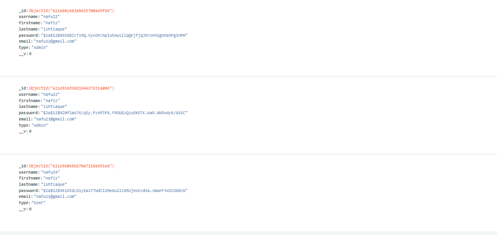
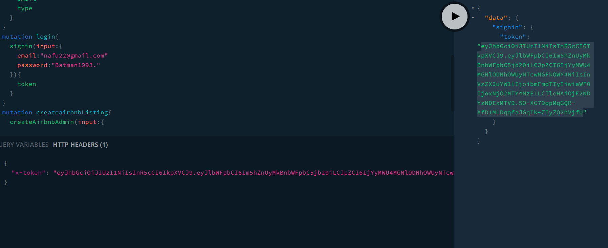
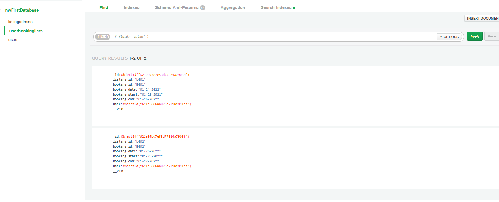
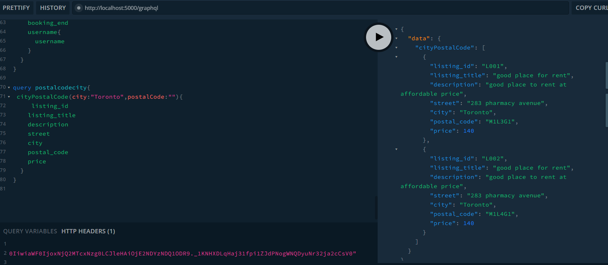

## create admin account 

#result

#signup user 

#userlogin

- token is used to log in 
- make sure copy paste it 
#admin listing 

#adminbooking 

#userbook

#result 

#getby city

#getby postalcode

#admin event 

#getby city

#post by user 

#loggined in result user

#admin listing 
